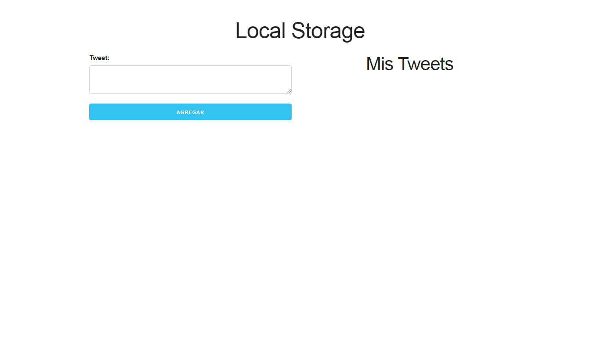

# localstorage-tweets-js
este es un proyecto javascript que guarda los tweets en el localstorage del navegador

Este aplicacion web permite al usuario lo siguiente: 
<li>Escribir tweets</li>
<li>Visualizar tweets en una lista que se guarda en el localstorage</li>
<li>Eliminar tweets</li>
<h3>Localstorage tweets</h3>

